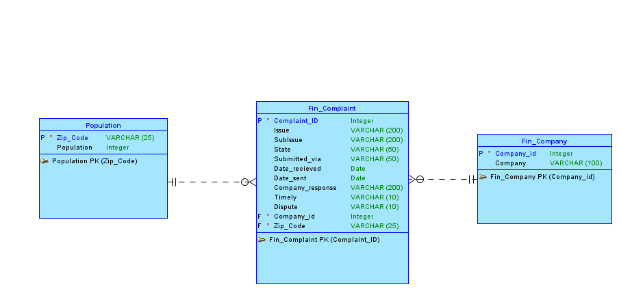

Data Science Fall 2014 R Project
===
**This project analyzes the Consumer Financial Complaints data from data.gov that have been supplemented with additional synthetic data and stored in an Oracle database.**


###This is how my RStudio is configured:
```{r}
sessionInfo()
```


<!-- CHANGE TO YOUR DIRECTORY -->
###These are the packages I load from .Rprofile:
```{r}
setwd("C:/Users/GalacticPresident/Documents/CSD/378_data_science") 
system("cat .Rprofile", intern = TRUE)
```


###Consumer Complaints Data Model
  


###Consumer Complaints Data 


<!-- CHANGE TO YOUR DIRECTORY ENDING IN /02ComplainData -->
####ConsumerComplain.ddl 
```{r}
setwd("C:/Users/GalacticPresident/Documents/CSD/378_data_science/02ComplainData")
system("cat ConsumerComplain.ddl", intern = TRUE)
``` 


<!-- MAYBE SHOW SOME INSERT STATEMENTS AS EXAMPLE DML? -->
```{r}
#Displaying some inserts maybe
```


<!-- DISPLAY FIRST ROWS OF THE TABLES FROM R, DO HEAD(TABLE) FUNCTIONS -->
```{r}
#Displaying some rows from R
```


<!-- CANNATA STUFF -->
<!-- ####First few rows of Complaints.dml -->


<!-- CANNATA STUFF, CHANGE ECHO TO TRUE TO DISPLAY -->
```{r, echo=FALSE}
#setwd("C:/Users/GalacticPresident/Documents/CSD/378_data_science/02DiamondsData")
#system("head Diamonds.dml.head", intern = TRUE)
``` 


<!-- CANNATA STUFF, CHANGE ECHO TO TRUE TO DISPLAY -->
<!-- ####Python script to generate synthetic Diamonds data. -->
```{r, tidy=TRUE, echo=FALSE}
#setwd("C:/Users/GalacticPresident/Documents/CSD/378_data_science/02DiamondsData")
# I can't get this to print out properly so I've commented it out for now.
#system("cat fakeDiamondsData.py", intern = TRUE)
``` 


<!-- CANNATA STUFF, CHANGE ECHO TO TRUE TO DISPLAY -->
<!-- ####DiamondsRest.ddl -->
```{r, echo=FALSE}
#setwd("C:/Users/GalacticPresident/Documents/CSD/378_data_science/02DiamondsData")
#system("cat DiamondsRest.ddl", intern = TRUE)
``` 


<!-- CANNATA STUFF, CHANGE ECHO TO TRUE TO DISPLAY -->
<!-- ####First few rows of fakeDiamondsData.dml -->
```{r, echo=FALSE}
#setwd("C:/Users/GalacticPresident/Documents/CSD/378_data_science/02DiamondsData")
#system("head fakeDiamondsData.dml.head", intern = TRUE)
``` 


<!-- DON'T CHANGE THIS DIRECTORY, WE DO R ANALYSIS AND DISPLAY OUR PLOTS AND STUFF HERE -->
```{r, echo=TRUE}
source("../03Analysis/MYPlots.R", echo = TRUE)
source("../03Analysis/ACPlots.R", echo = TRUE)
#source("../03Analysis/.R", echo = TRUE)
```


###shiny
**The shiny R package allows you to build interactive web-based applications using only R with no knowledge of html, css, or javascript needed. You just need to write two scripts (see the example files in the 04Shiny directory):**  

* ui.R : Defines the layout and the interactive elements that the user can access.  
* server.R : Defines what computations are done in response to user interactions. 

See also http://shiny.rstudio.com and http://shiny.rstudio.com/tutorial 

To run the shiny app that's in the 04Shiny directory run the following in the main RWorkshop directory (make sure the working directory is set to this directory):  
library(shiny)  
runApp("04Shiny")   # Make sure there are no spaces in the string argument to runAPP

This should pop the application up in a browser, you can also access it in a browser at http://127.0.0.1:6837. 

###shinyapps

The example above ran the shiny app on your local machine, but to share with others, you have to send around the R files and the user needs to have R and know a little bit about it.

Instead, you can remotely host shiny apps and then just send people links. Get a free account at shinyapps.io/signup.html and give it a try.

**library("devtools", lib.loc="/Library/Frameworks/R.framework/Versions/3.0/Resources/library")  
install_github( repo = "shinyapps", username="rstudio" )  
shinyapps::setAccountInfo(name='pcannata', token='3ECF447A741004F6A8B7208C9ED778E1', secret='. . . ')**  

<!-- FILL THIS IN EVENTUALLY IF WE NEED SHINY AND CHANGE ECHO TO TRUE TO DISPLAY -->
```{r, echo=FALSE}
#library(shinyapps)
#getwd()

# Uncomment the following line to deploy the app.
# deployApp("../04Shiny")
```


**Now you can try the app at https://pcannata.shinyapps.io/04Shiny/ **  

See also https://www.shinyapps.io/ and http://shiny.rstudio.com/articles/shinyapps.html 
